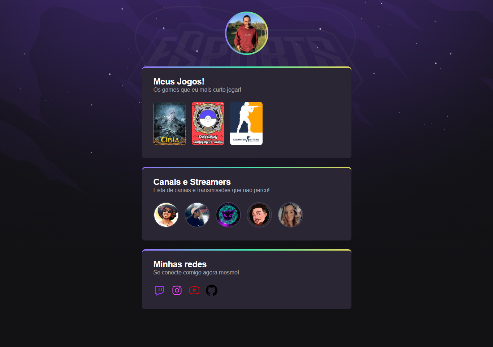

# NLW eSports 

>Trilha Explorer

Projeto construído do evento Next Level Week da Rocketseat.

[🔗 Clique aqui para acessar](https://luprime.github.io/nlw-esports-explorer)

## 👨‍💻 Tecnologia

- HTML
- CSS
- Git e Github

## 💭 O que aprendi?

Neste projeto aprendi a programar com HTML básico e CSS básico, para criar uma aplicação que mostraria os jogos e streamers que mais assiste em uma página similar ao de um menu. Também foi ensinado como editar e mexer no Github para publicar este projeto.

## 📚 Contato

- 📧 - lucas.primati@hotmail.com
- 👨🏽‍💼 - https://www.linkedin.com/in/lucas-primati/

